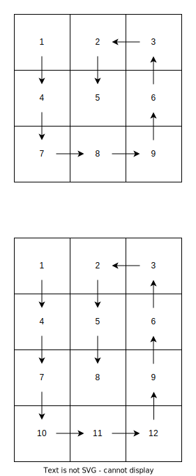

# Cryptonix.Security.Random

## Spiralizer

Sample Array 1: {1, 2, 3, 4, 5, 6, 7, 8, 9}
Sample Array 2: {1, 2, 3, 4, 5, 6, 7, 8, 9, 10, 11, 12}

Transform the linear array and spiralize it like here: 

